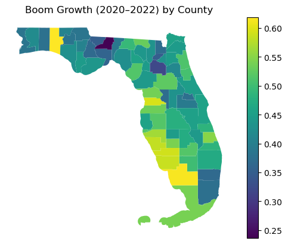
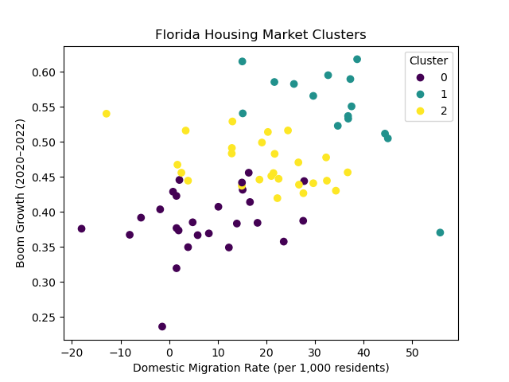
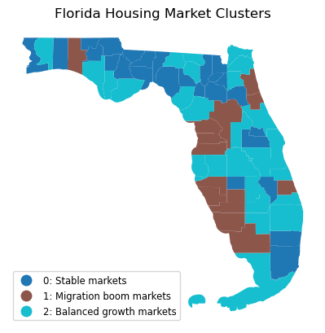

# Florida Housing & Migration Analysis (2020–2024)


County-level analysis of housing price growth, domestic migration, market segmentation, and post-boom cooling across Florida.

This project combines **Python analysis**, **county-level geospatial visualization**, and a **Tableau story** to examine how Florida housing markets changed during and after the pandemic-era boom.

---

## Table of Contents

- [Florida Housing \& Migration Analysis (2020–2024)](#florida-housing--migration-analysis-20202024)
  - [Table of Contents](#table-of-contents)
  - [Project Snapshot](#project-snapshot)
  - [Business Context](#business-context)
  - [Research Questions](#research-questions)
  - [Hypotheses](#hypotheses)
  - [Interactive Deliverable](#interactive-deliverable)
  - [Visual Highlights](#visual-highlights)
    - [Housing Price Growth During the Pandemic Boom (2020–2022)](#housing-price-growth-during-the-pandemic-boom-20202022)
    - [Domestic Migration vs. Housing Price Growth](#domestic-migration-vs-housing-price-growth)
    - [Florida Housing Market Segments](#florida-housing-market-segments)
  - [Tools Used](#tools-used)
  - [Data Sources](#data-sources)
    - [1) Zillow ZHVI](#1-zillow-zhvi)
    - [2) U.S. Census Population Estimates (PEP)](#2-us-census-population-estimates-pep)
    - [3) U.S. Census TIGER/Line Shapefiles](#3-us-census-tigerline-shapefiles)
  - [Methodology](#methodology)
    - [1. Data Preparation](#1-data-preparation)
    - [2. Feature Engineering](#2-feature-engineering)
    - [3. Modeling \& Analysis](#3-modeling--analysis)
  - [Key Findings](#key-findings)
    - [1) Pandemic housing growth was uneven across Florida](#1-pandemic-housing-growth-was-uneven-across-florida)
    - [2) Domestic migration was positively associated with stronger housing growth](#2-domestic-migration-was-positively-associated-with-stronger-housing-growth)
    - [3) Florida counties cluster into three market segments](#3-florida-counties-cluster-into-three-market-segments)
    - [4) The strongest boom markets also cooled the most after 2022](#4-the-strongest-boom-markets-also-cooled-the-most-after-2022)
  - [Regression Summary](#regression-summary)
  - [Clustering Summary](#clustering-summary)
  - [Limitations](#limitations)
  - [Visual Outputs](#visual-outputs)
    - [Python Visuals](#python-visuals)
    - [Tableau Story Sections](#tableau-story-sections)
  - [Skills Demonstrated](#skills-demonstrated)
  - [Repository Structure](#repository-structure)
  - [Data Dictionary](#data-dictionary)
  - [Setup](#setup)
  - [Reproducing the Analysis](#reproducing-the-analysis)
  - [Future Improvements](#future-improvements)
  - [Project Status](#project-status)
  - [License](#license)
  - [Notes for Recruiters](#notes-for-recruiters)
  - [Tableau Story Link](#tableau-story-link)

**Interactive Tableau Story:** [Florida Housing Market Dynamics During and After the Pandemic (2020–2024)](https://public.tableau.com/views/FloridaHousingMigrationAnalysis20202024/Story1?:language=en-US&:sid=&:redirect=auth&:display_count=n&:origin=viz_share_link)

---

## Project Snapshot

This portfolio project analyzes **Florida county-level housing market dynamics** during and after the COVID-era housing boom. It evaluates whether **net domestic migration** was associated with stronger home value growth, identifies **distinct county housing market segments**, and measures how growth **cooled after 2022**.

The housing metric used is Zillow’s **ZHVI (Zillow Home Value Index)**, annualized from monthly county-level observations. Migration and population data come from the U.S. Census Bureau’s **Population Estimates Program (CO-EST2024-ALLDATA)**. These sources are merged into a **county-year panel dataset** covering Florida’s 67 counties from **2020–2024**, and the final communication layer is an interactive **Tableau story** that presents the analytical results in a stakeholder-friendly narrative.

This project demonstrates:

- Structured problem framing
- Multi-source data integration
- Panel data transformation (wide → long)
- Feature engineering for time-series analysis
- Regression modeling and interpretation
- Unsupervised clustering
- Geospatial visualization
- Stakeholder-oriented storytelling via an interactive Tableau story

---

## Business Context

Since 2020, Florida has experienced substantial housing appreciation and heightened affordability concerns. Public narratives frequently attribute price acceleration to domestic in-migration.

This project evaluates county-level housing market dynamics to identify:

1. Geographic concentration of appreciation
2. Post-2022 growth deceleration patterns
3. Statistical association between domestic migration and home value growth
4. Distinct housing market segments across counties

---

## Research Questions

1. **Growth & Cooling**
   Which Florida counties experienced the strongest ZHVI growth from 2020–2022, and did growth slow after 2022?

2. **Migration Relationship**
   Is net domestic migration positively associated with county-level home value growth during the housing boom?

3. **Segmentation**
   Can Florida counties be grouped into distinct housing market profiles based on growth, volatility, and migration?

---

## Hypotheses

- **H1:** Net domestic migration is positively associated with county-level home value growth during 2020–2022.
- **H2:** Home price growth slowed meaningfully after 2022 across most Florida counties.
- **H3:** Florida counties can be clustered into distinct housing market segments.

> This project does **not** directly test buyer origin, investor activity, or cash-purchase behavior, since those require transaction-level or parcel-level data outside the scope of the selected sources.

---

## Interactive Deliverable

The final storytelling layer for this project is a **Tableau Story** that walks through the analysis in a clear narrative sequence:

1. Pandemic housing boom context
2. Where housing prices grew the most
3. Migration vs. housing growth relationship
4. County housing market segmentation
5. Post-boom cooling across counties

**View the full interactive story here:**
[Florida Housing Market Dynamics During and After the Pandemic (2020–2024)](https://public.tableau.com/views/FloridaHousingMigrationAnalysis20202024/Story1?:language=en-US&:sid=&:redirect=auth&:display_count=n&:origin=viz_share_link)

---

## Visual Highlights

A few key visuals are embedded below for quick scanning. The full narrative and interactive version live in the Tableau Story linked above.

### Housing Price Growth During the Pandemic Boom (2020–2022)



### Domestic Migration vs. Housing Price Growth



### Florida Housing Market Segments



---

## Tools Used

- **Python** — data cleaning, feature engineering, regression, clustering, and geospatial analysis
- **pandas / NumPy** — panel data transformation and feature creation
- **statsmodels** — OLS regression modeling
- **scikit-learn** — clustering and feature standardization
- **GeoPandas** — county-level choropleth mapping
- **Matplotlib / Seaborn** — exploratory and explanatory visualization
- **Tableau Public** — stakeholder-facing interactive storytelling

---

## Data Sources

### 1) Zillow ZHVI

- **Dataset:** County ZHVI (mid-tier, all homes, smoothed, seasonally adjusted)
- **Raw file:** `data/raw/County_zhvi_uc_sfrcondo_tier_0.33_0.67_sm_sa_month.csv`
- **Granularity:** Monthly, county-level
- **Use in project:** Annualized county home value analysis and growth feature engineering

### 2) U.S. Census Population Estimates (PEP)

- **Dataset:** CO-EST2024-ALLDATA (States and Counties), April 1, 2020 – July 1, 2024
- **Raw file:** `data/raw/co-est2024-alldata.csv`
- **Granularity:** Annual, county-level
- **Key fields used:** `SUMLEV`, `STATE`, `COUNTY`, `POPESTIMATE20xx`, `DOMESTICMIG20xx`, `RDOMESTICMIG20xx`

### 3) U.S. Census TIGER/Line Shapefiles

- **Dataset:** County boundary shapefiles
- **Local folder:** `data/raw/shapefiles/`
- **Use in project:** County-level choropleth mapping in Python

---

## Methodology

### 1. Data Preparation

- Reshape Zillow ZHVI from wide format to long format (`county`, `date`, `zhvi`)
- Filter Zillow data to Florida counties
- Convert monthly ZHVI to annual county values
- Reshape Census migration and population data from wide to long
- Filter Census data to Florida county-level records (`SUMLEV == 050`)
- Construct standardized 5-digit FIPS codes for merge consistency

### 2. Feature Engineering

Engineered county-level features include:

- **YoY Growth** — annual percent change in ZHVI
- **Boom Growth (2020–2022)** — cumulative home price growth from 2020 to 2022
- **Cooling Delta (2024 vs 2022)** — change in YoY growth rate between 2022 and 2024
- **YoY Volatility** — standard deviation of yearly home price growth
- **Net Domestic Migration Rate** — annual net domestic migration rate per 1,000 residents used in regression and clustering

### 3. Modeling & Analysis

- Exploratory data analysis (distributions, rankings, boom vs. cooling comparisons)
- OLS regression of housing growth on migration during boom and cooling periods
- K-means clustering with elbow-method validation
- County-level geospatial mapping using GeoPandas
- Narrative Tableau story for stakeholder-facing communication

---

## Key Findings

### 1) Pandemic housing growth was uneven across Florida

County-level housing appreciation varied substantially during 2020–2022. Coastal and tourism-oriented counties experienced the strongest cumulative growth, with some counties exceeding **60%** during the boom period.

**Highest observed boom growth:** Walton County (~61.8%)

### 2) Domestic migration was positively associated with stronger housing growth

Counties experiencing stronger domestic migration generally show higher housing price growth during the pandemic period.

OLS regression results suggest that migration had a **positive and statistically significant** relationship with county-level home value growth during the boom, but that relationship weakened materially during the cooling period.

### 3) Florida counties cluster into three market segments

K-means clustering identified three distinct housing market types:

- **Stable markets** — lower migration, lower growth, lower volatility
- **Balanced growth markets** — moderate migration and moderate growth
- **Migration boom markets** — highest migration, strongest boom growth, strongest subsequent slowdown

These clusters suggest Florida’s housing boom was not a single statewide phenomenon, but a mix of distinct local market regimes.

### 4) The strongest boom markets also cooled the most after 2022

Growth slowed across nearly all counties after 2022, but the slowdown was strongest in several markets that had experienced the largest pandemic-era surges.

This supports a broader interpretation that the most overheated counties experienced the greatest post-boom normalization.

---

## Regression Summary

Ordinary Least Squares (OLS) regression was used to evaluate the statistical relationship between net domestic migration and home value growth.

| Period              | Migration Coefficient | p-value | R²    | Interpretation                                                                              |
| ------------------- | --------------------- | ------- | ----- | ------------------------------------------------------------------------------------------- |
| Boom (2021–2022)    | ~0.0005               | 0.005   | 0.059 | Migration is positively associated with stronger home value growth during the boom          |
| Cooling (2023–2024) | ~-0.0002              | 0.235   | 0.011 | Migration does not meaningfully explain county growth differences during the cooling period |

These results suggest a **regime-dependent relationship** between migration and housing market performance.

---

## Clustering Summary

K-means clustering used four engineered features:

- Boom growth (2020–2022)
- Cooling delta (2024 vs 2022)
- Growth volatility
- Net domestic migration rate

The elbow method supported **k = 3** clusters.

| Cluster | Boom Growth | Migration Rate | Volatility | Cooling Pattern    | Interpretation              |
| ------- | ----------- | -------------- | ---------- | ------------------ | --------------------------- |
| 0       | Lower       | Low            | Low        | Mild slowdown      | **Stable markets**          |
| 1       | Highest     | Very High      | Highest    | Strongest slowdown | **Migration boom markets**  |
| 2       | Moderate    | Moderate       | Moderate   | Moderate slowdown  | **Balanced growth markets** |

This clustering supports the idea that Florida counties can be grouped into distinct housing market profiles rather than treated as one uniform statewide market.

---

## Limitations

- This analysis evaluates **county-level relationships**, not individual buyer behavior.
- It does **not** identify where movers came from (for example, specific origin states such as New York or California).
- It does **not** directly measure investor activity, cash purchases, or parcel-level transaction behavior.
- Regression results are **associational**, not causal.
- County-level aggregation may mask important within-county variation.

---

## Visual Outputs

### Python Visuals

Several of these visuals are embedded above in the **Visual Highlights** section for quick review.

- `visuals/florida_boom_growth_map.png`
- `visuals/florida_housing_clusters_map.png`
- `visuals/florida_migration_rate_map.png`
- `visuals/housing_clusters_scatter.png`
- `visuals/housing_clusters_stability.png`
- `visuals/migration_vs_growth_all.png`
- `visuals/migration_vs_growth_boom.png`
- `visuals/migration_vs_growth_cooling.png`
- `visuals/yoy_growth_distribution.png`
- `visuals/domestic_migration_distribution.png`

### Tableau Story Sections

The Tableau story presents the final narrative in five parts:

1. **Pandemic Housing Boom in Florida**
2. **Housing Price Growth During the Pandemic Boom (2020–2022)**
3. **Domestic Migration and Housing Price Growth**
4. **Florida Housing Markets Cluster into Three Segments**
5. **Housing Markets Slowed After the Pandemic Boom**

---

## Skills Demonstrated

- Data reshaping (wide-to-long panel transformations)
- Multi-source integration via FIPS join keys
- Time-series feature engineering
- Exploratory data analysis
- Linear regression modeling (statsmodels)
- Unsupervised learning (k-means clustering)
- Geospatial visualization (GeoPandas)
- Data storytelling in Tableau

---

## Repository Structure

```text
florida-housing-migration-analysis/
├── README.md
├── DATA_DICTIONARY.md
├── requirements.txt
├── .gitignore
│
├── data/
│   ├── raw/
│   │   ├── co-est2024-alldata.csv
│   │   ├── County_zhvi_uc_sfrcondo_tier_0.33_0.67_sm_sa_month.csv
│   │   └── shapefiles/ (Census TIGER/Line county boundaries)
│   └── processed/
│       ├── zhvi_fl_long.csv
│       ├── census_fl_county_year.csv
│       ├── merged_fl_county_year.csv
│       ├── merged_fl_county_year_features.csv
│       └── merged_fl_county_year_clusters.csv
│
├── notebooks/
│   ├── 01_data_loading_zhvi.ipynb
│   ├── 02_data_loading_census.ipynb
│   ├── 03_merging.ipynb
│   ├── 04_feature_engineering.ipynb
│   ├── 05_exploratory_analysis.ipynb
│   ├── 06_regression_analysis.ipynb
│   ├── 07_clustering.ipynb
│   └── 08_geospatial_analysis.ipynb
│
└── visuals/
    ├── domestic_migration_distribution.png
    ├── florida_boom_growth_map.png
    ├── florida_housing_clusters_map.png
    ├── florida_migration_rate_map.png
    ├── housing_clusters_scatter.png
    ├── housing_clusters_stability.png
    ├── migration_vs_growth_all.png
    ├── migration_vs_growth_boom.png
    ├── migration_vs_growth_colored.png
    ├── migration_vs_growth_cooling.png
    └── yoy_growth_distribution.png
```

---

## Data Dictionary

The processed modeling dataset is documented in \
`DATA_DICTIONARY.md`.

This file explains the final county-year analytical dataset, variable definitions, engineered features, clustering labels, and source provenance for the merged Florida housing and migration workflow.

---

---

## Setup

Install dependencies:

```bash
pip install -r requirements.txt
```

Core dependencies include:

- pandas
- numpy
- matplotlib
- seaborn
- scikit-learn
- statsmodels
- geopandas
- shapely
- pyogrio

---

## Reproducing the Analysis

Suggested notebook order:

1. `01_data_loading_zhvi.ipynb`
2. `02_data_loading_census.ipynb`
3. `03_merging.ipynb`
4. `04_feature_engineering.ipynb`
5. `05_exploratory_analysis.ipynb`
6. `06_regression_analysis.ipynb`
7. `07_clustering.ipynb`
8. `08_geospatial_analysis.ipynb`

---

## Future Improvements

- Add a summary notebook or script that reproduces the full workflow end-to-end
- Add a concise results appendix with exported regression tables and cluster summaries
- Add notebook-level headers with inputs, outputs, and purpose statements
- Add a small `results/` section or appendix with exported model summaries
- Expand the project with transaction-level or affordability data for deeper causal interpretation

---

## Project Status

- [x] Repository scaffolded
- [x] Raw datasets integrated
- [x] Zillow reshaped to panel format
- [x] Census reshaped to panel format
- [x] Merge Zillow and Census datasets
- [x] Annualize ZHVI + feature engineering
- [x] Exploratory data analysis (EDA)
- [x] Regression modeling
- [x] Clustering
- [x] Geospatial mapping
- [x] Tableau story published

---

## License

This project may be shared under the MIT License. Add a \
`LICENSE` file at the repository root if you want recruiters, collaborators, and other GitHub users to clearly see the reuse terms.

---

## Notes for Recruiters

This project is designed to show both **analytical depth** and **communication clarity**. It emphasizes:

- Clear problem framing
- Reproducible Python workflows
- Structured multi-dataset integration
- Defensible statistical reasoning
- Transparent discussion of limitations
- County-level geospatial and cluster analysis
- Stakeholder-oriented storytelling through an interactive Tableau story

If you’re reviewing this project quickly, the best order is:

1. Read the **Project Snapshot**, **Key Findings**, and **Data Dictionary** sections
2. Open the **Interactive Tableau Story**
3. Review the Python notebooks to inspect the analytical workflow
4. Skim the regression and clustering summaries in this README for the main results

---

## Tableau Story Link

[Florida Housing Market Dynamics During and After the Pandemic (2020–2024)](https://public.tableau.com/views/FloridaHousingMigrationAnalysis20202024/Story1?:language=en-US&:sid=&:redirect=auth&:display_count=n&:origin=viz_share_link)
