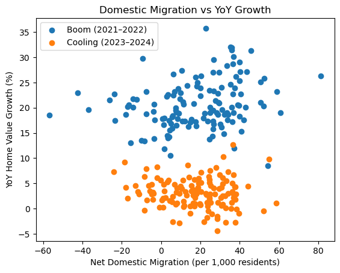

# Florida Housing & Migration Analysis (2020–2024)

County-level analysis of housing price growth, domestic migration, market segmentation, and post-boom cooling across Florida using Python, geospatial analysis, and Tableau storytelling.

[View the Tableau Story](https://public.tableau.com/views/FloridaHousingMigrationAnalysis20202024/Story1?:language=en-US&:sid=&:redirect=auth&:display_count=n&:origin=viz_share_link)

## Visual Highlights

### Domestic Migration vs. Home Value Growth



### Florida Housing Market Clusters


---

## Executive Summary

This project analyzes how Florida housing markets changed during and after the pandemic-era boom from **2020 to 2024**. Using Zillow home value data, U.S. Census migration and population estimates, and county shapefiles, I built a county-year analytical dataset covering all **67 Florida counties**.

The analysis focused on three questions:

- Which counties experienced the strongest housing growth during the boom?
- Was net domestic migration associated with stronger home value growth?
- Can Florida counties be grouped into distinct housing market types?

To answer these questions, I used **Python** for data cleaning, feature engineering, regression analysis, clustering, and geospatial mapping, then translated the results into a stakeholder-friendly **Tableau story**.

### Key Takeaways

- Pandemic-era housing growth was **uneven across Florida**, with some counties seeing exceptionally strong appreciation.
- Counties with stronger **net domestic migration** generally experienced stronger housing growth during the boom period.
- Florida counties grouped into **three distinct housing market segments**, with the fastest-growth markets also showing the sharpest post-2022 cooling.

---

## Business Problem

Florida experienced sharp home price appreciation during and after the COVID-era housing boom, alongside growing affordability pressure and public debate about the role of migration.

This project evaluates county-level housing market dynamics to understand:

- where appreciation was most concentrated
- how strongly migration was associated with home value growth
- which counties behaved similarly as housing markets
- how the strongest boom markets changed after 2022

The goal was to move beyond a statewide narrative and identify whether Florida’s housing boom was actually a mix of different local market patterns.

---

## Dataset

This project combines three data sources:

### 1. Zillow ZHVI

- County-level Zillow Home Value Index (ZHVI)
- Monthly home value data
- Used to measure annual home value growth and cumulative boom-period appreciation

### 2. U.S. Census Population Estimates Program

- County-level population and domestic migration estimates
- Used to calculate migration rates and compare population movement to housing growth

### 3. U.S. Census TIGER/Line Shapefiles

- County boundary shapefiles
- Used for county-level geospatial visualization in Python

### Analytical Scope

- Geography: **Florida counties**
- Time period: **2020–2024**
- Unit of analysis: **county-year**
- Final coverage: **67 counties**

---

## Tools & Skills Demonstrated

- **Python**
- **pandas / NumPy**
- **statsmodels**
- **scikit-learn**
- **GeoPandas**
- **Matplotlib / Seaborn**
- **Tableau Public**

### Core Skills

- data cleaning and reshaping
- multi-source data integration
- panel-style data transformation
- feature engineering
- linear regression
- k-means clustering
- geospatial visualization
- stakeholder-facing storytelling

---

## Methodology

### 1. Data Preparation

- reshaped Zillow housing data from wide to long format
- filtered source data to Florida counties
- annualized monthly housing values
- reshaped Census population and migration fields to county-year format
- standardized FIPS codes for reliable joins across datasets

### 2. Feature Engineering

Created county-level features including:

- year-over-year home value growth
- cumulative boom growth (2020–2022)
- post-boom cooling change
- growth volatility
- net domestic migration rate

### 3. Analysis

- exploratory data analysis to identify county growth patterns
- OLS regression to test the relationship between migration and housing growth
- k-means clustering to segment counties by growth, migration, and volatility
- geospatial mapping to visualize regional differences
- Tableau story to communicate findings in a narrative format

---

## Key Findings

### 1. Housing growth was highly uneven across Florida

Florida’s housing boom was not evenly distributed. Some counties experienced dramatically stronger appreciation than others during 2020–2022, with several coastal and high-demand counties leading the state.

### 2. Domestic migration was positively associated with stronger boom-period growth

Counties with higher domestic migration generally showed stronger home value growth during the pandemic-era boom. The scatterplot below illustrates a clearer positive relationship during the boom period than during the later cooling phase, where growth became more muted and less strongly tied to migration.

### 3. Florida counties grouped into three market segments

Clustering analysis identified three broad county profiles:

- **Stable markets** — lower migration, lower growth, lower volatility
- **Balanced growth markets** — moderate migration and moderate appreciation
- **Migration boom markets** — strongest growth, highest migration, and strongest post-2022 cooling

The cluster map highlights that Florida's housing boom was not one uniform statewide pattern. Instead, counties fell into distinct market types with different combinations of migration pressure, appreciation, and cooling behavior.

### 4. The hottest boom markets cooled the most after 2022

Many counties that experienced the strongest early growth also saw the largest slowdown later, suggesting a post-boom normalization effect.

---

## Regression Summary

OLS regression was used to evaluate whether net domestic migration was associated with stronger county-level housing growth.

### Result Summary

- During the **boom period**, migration showed a **positive and statistically significant** relationship with home value growth.
- During the **cooling period**, migration no longer meaningfully explained variation in county growth.

### Interpretation

Migration appears to have mattered more during the rapid expansion phase than during the later market adjustment.

---

## Why This Project Matters

This project demonstrates the kind of work expected in real analytics settings:

- integrating multiple messy public data sources
- building a defensible analytical workflow
- choosing appropriate methods for the question
- communicating uncertainty and limitations clearly
- translating technical analysis into business- and stakeholder-friendly outputs

It also shows range: statistical analysis, unsupervised learning, geospatial analysis, and executive-style storytelling in one project.

---

## Deliverables

- **Python notebooks** for cleaning, feature engineering, regression, clustering, and mapping
- **Processed analytical datasets**
- **Static visuals** for quick review
- **Map-based and scatterplot visuals** included in the `visuals/` folder for recruiter-friendly review
- **Interactive Tableau story** for final communication

---

## Repository Structure

```text
florida-housing-migration-analysis/
├── README.md
├── DATA_DICTIONARY.md
├── requirements.txt
├── data/
│   ├── raw/
│   └── processed/
├── notebooks/
│   ├── 01_data_loading_zhvi.ipynb
│   ├── 02_data_loading_census.ipynb
│   ├── 03_merging.ipynb
│   ├── 04_feature_engineering.ipynb
│   ├── 05_exploratory_analysis.ipynb
│   ├── 06_regression_analysis.ipynb
│   ├── 07_clustering.ipynb
│   └── 08_geospatial_analysis.ipynb
└── visuals/
```

## How to Review This Project Quickly

1. Read the **Executive Summary**
2. Review the **Visual Highlights**
3. Skim the **Key Findings**
4. Open the **Tableau Story**
5. Review the notebooks if you want to inspect the technical workflow

---

## Limitations

- This is a county-level analysis, not a transaction-level or buyer-level study.
- The results are associational, not causal.
- County averages may hide important within-county variation.
- The project does not directly measure investor activity, buyer origin by state, or parcel-level behavior.

---

## Future Improvements

- add a single end-to-end executive summary notebook for faster portfolio review
- export regression tables and cluster summaries to a dedicated results folder
- incorporate affordability or transaction-level data for deeper explanation
- expand time horizon as more county-level data becomes available

---

## Author

**Spencer Davis**

Data Analyst Portfolio Project
